

<!-- Animated Waving Neon Header -->

  

<!-- Animated Dynamic Typing Title -->

 

<!-- SVG Project Hero Banner -->

  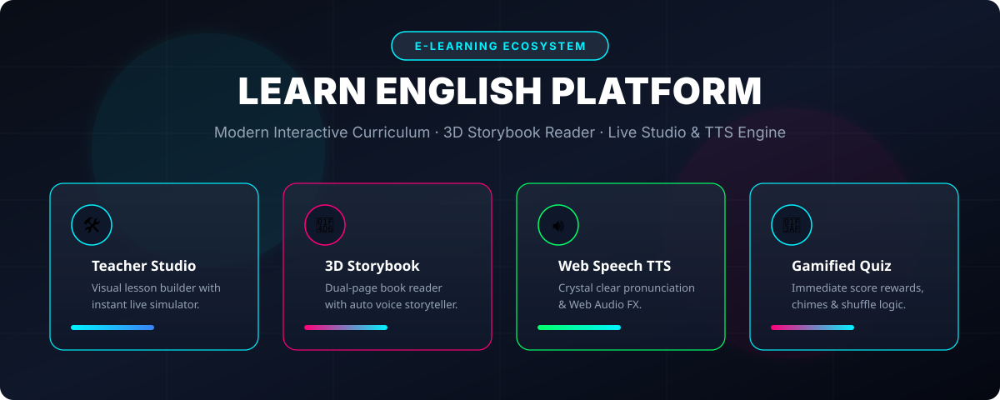

 

<!-- Neon Cyberpunk Badges -->

 

<!-- Animated Glowing Line Divider SVG -->

  

 

<!-- 1. The Four Pillars SVG -->

  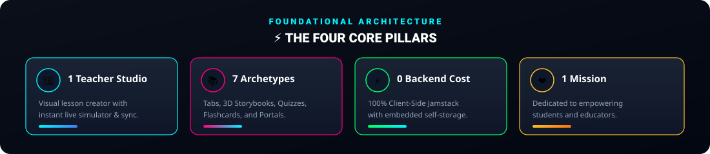

 

<!-- 2. Runtime Snapshot SVG -->

  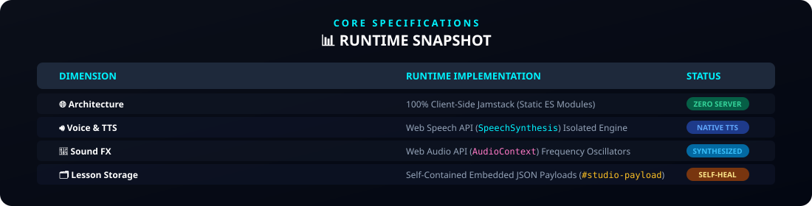

 

<!-- 3. What is Learn English Platform SVG -->

  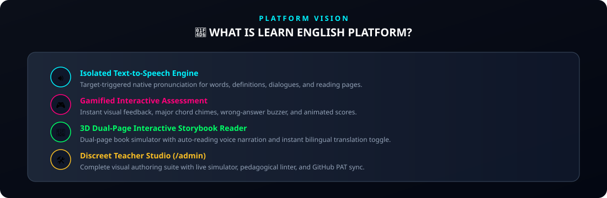

 

<!-- 4. 7 Modular Educational Archetypes SVG -->

  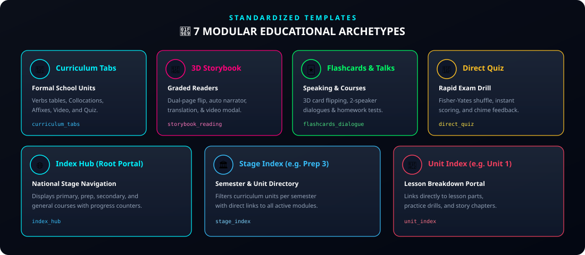

 

<!-- 5. System Architecture & Data Flow SVG -->

  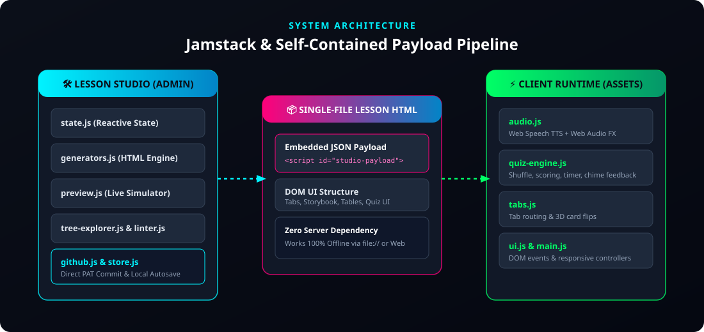

 

<!-- 6. Interaction & Learning Workflow SVG -->

  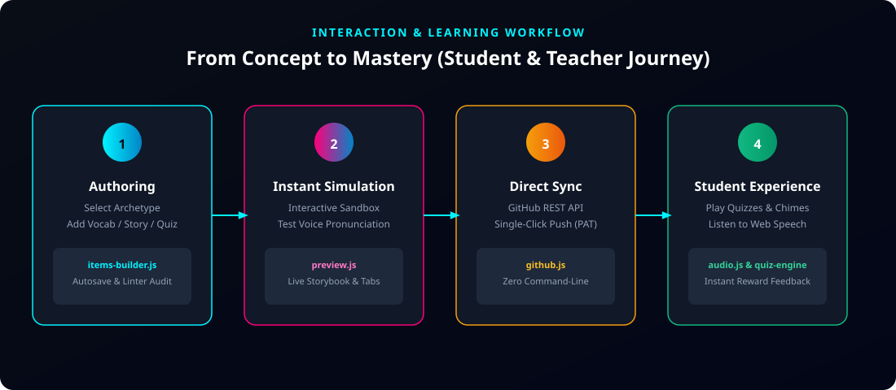

 

<!-- 7. Lesson State Lifecycle SVG -->

  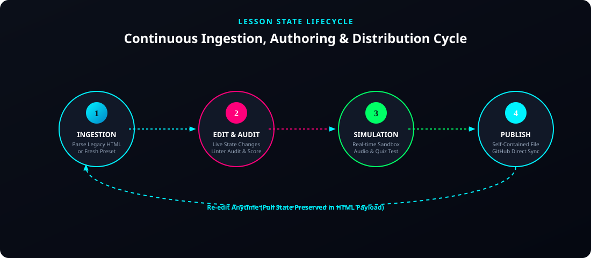

 

<!-- 8. Dual Audio Engine SVG -->

  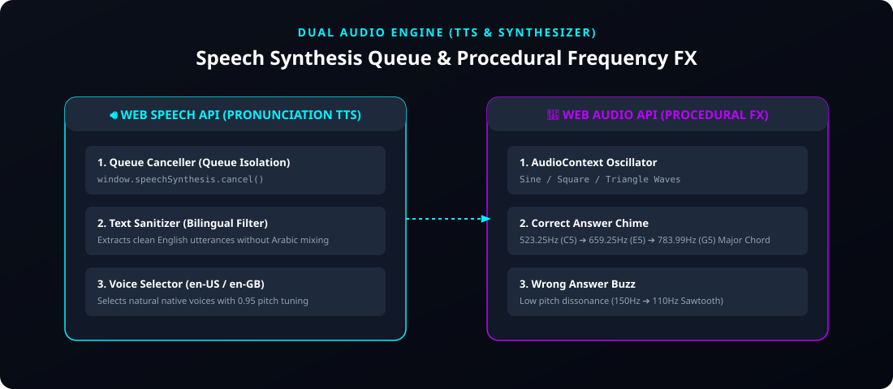

 

<!-- 9. Project Tree Structure SVG -->

  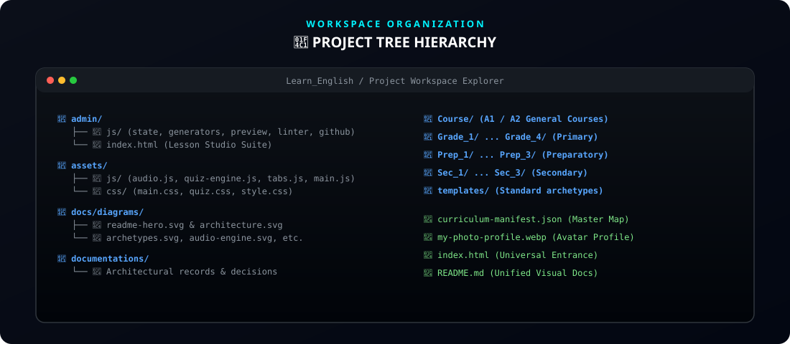

 

<!-- 10. Quick Start SVG -->

  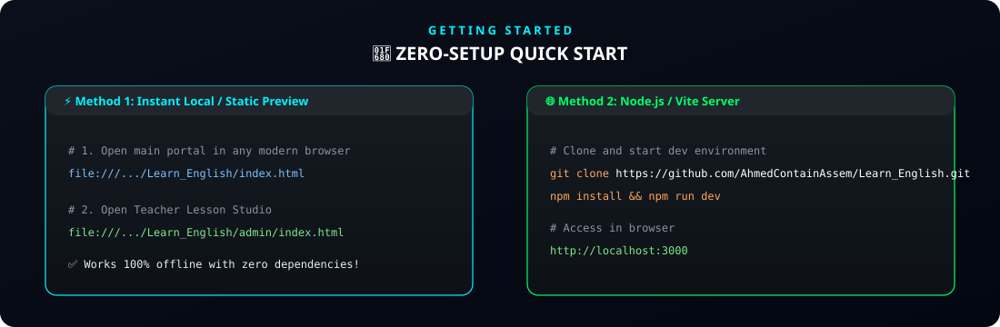

 

| 🔐 Portal / Component | 📍 Path | 🔑 Default Passcode |
| :--- | :--- | :---: |
| **Lesson Studio (Teacher Portal)** | `Learn_English/admin/index.html` | `ahmed2026` |

 

<!-- Visual Interface Showcase: Teacher Lesson Studio -->

  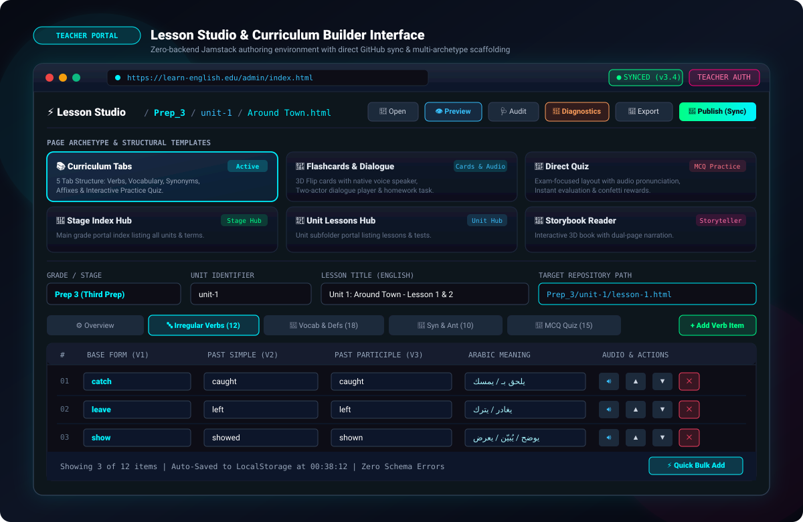

 

<!-- Visual Interface Showcase: Student Experience & 3D Storybook -->

  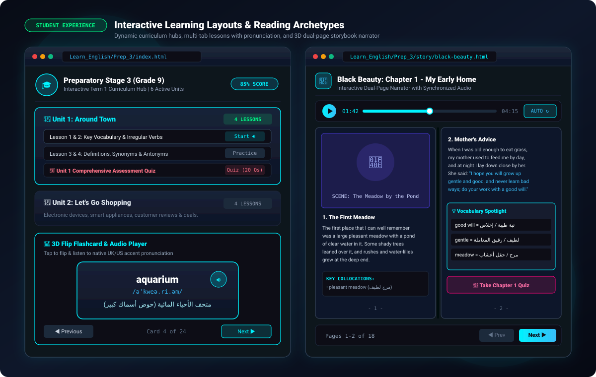

 

<!-- Visual Interface Showcase: System Diagnostics & One-Click GitHub Publisher -->

  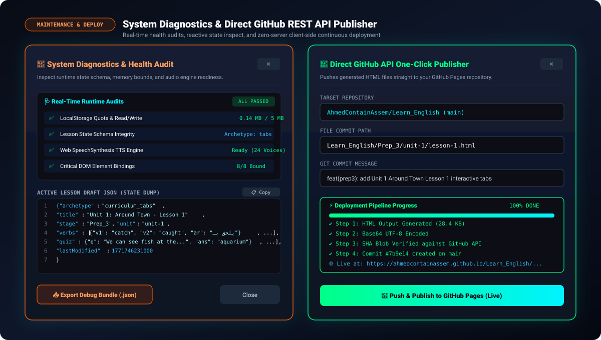

 

<!-- 11. Lesson Authoring Workflow SVG -->

  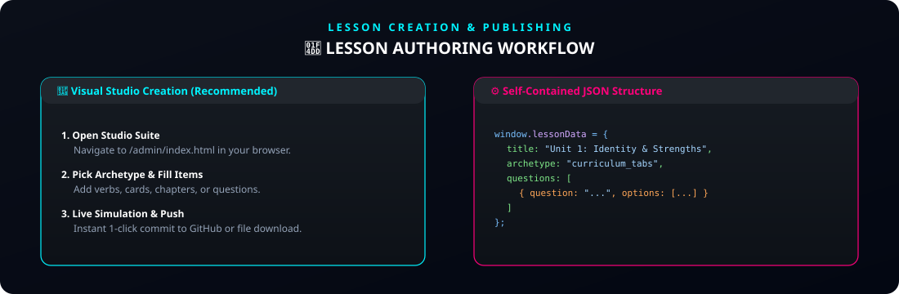

 

<!-- 12. Core Design Principles SVG -->

  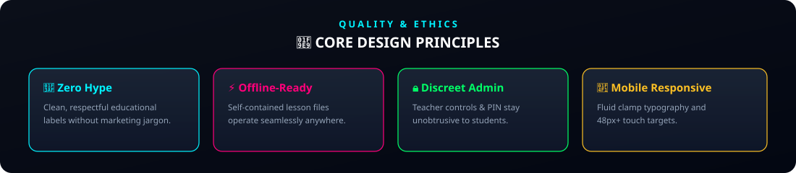

 

<!-- 13. Arabic Version Summary SVG -->

  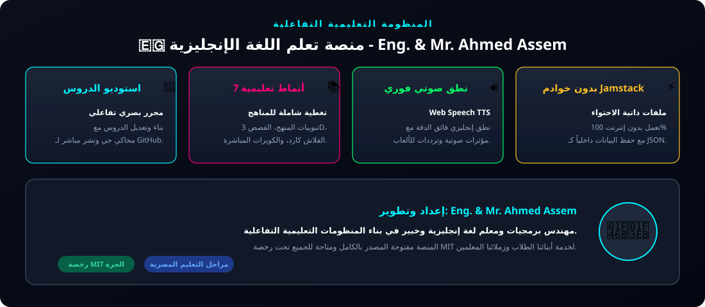

 

<!-- 14. Footer Banner SVG -->

  

 

